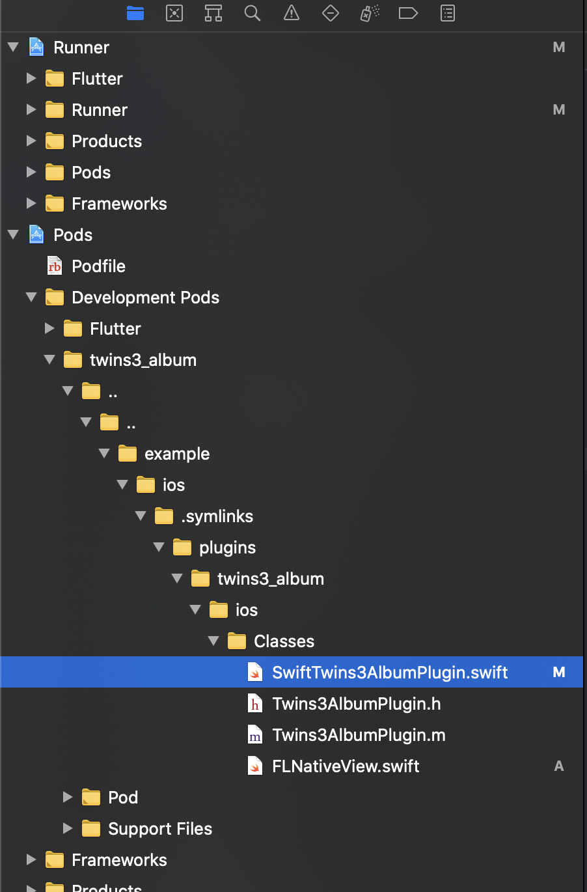

# twins3_album

A new flutter plugin project.

## Getting Started

This project is a starting point for a Flutter
[plug-in package](https://flutter.dev/developing-packages/),
a specialized package that includes platform-specific implementation code for
Android and/or iOS.

For help getting started with Flutter, view our
[online documentation](https://flutter.dev/docs), which offers tutorials,
samples, guidance on mobile development, and a full API reference.


### 初始化
初始化工程
`flutter create --template=plugin --platforms=android,ios -a java -i swift twins3_album`
先构建一次
```shell
cd ./example;
flutter build ios --no-codesign
```

### 运行example
使用xcode 打开 ./example/ios/Runner.xcworkspace

### 编写平台代码
#### ios

- 在info.plist 添加相关权限申请，如 **NSPhotoLibraryUsageDescription**

- xcode 下，在 `Pods/Development Pods/..../Classes/` 文件夹下编写代码



- [创建平台视图](https://flutter.cn/docs/development/platform-integration/platform-views?tab=android-platform-views-java-tab#on-the-platform-side-1)，然后在在 `*Plugin.swift`注册视图

```swift
import Flutter
import UIKit

public class SwiftTwins3AlbumPlugin: NSObject, FlutterPlugin {
  public static func register(with registrar: FlutterPluginRegistrar) {
    let channel = FlutterMethodChannel(name: "twins3_album", binaryMessenger: registrar.messenger())
    let instance = SwiftTwins3AlbumPlugin()
    registrar.addMethodCallDelegate(instance, channel: channel)
    
    // 注册视图
    let factory = FLNativeViewFactory(messenger: registrar.messenger())
    registrar.register(factory, withId: "twins3_album_view")
  }

  public func handle(_ call: FlutterMethodCall, result: @escaping FlutterResult) {
    result("iOS " + UIDevice.current.systemVersion)
  }
}
```

- 在 dart 端，在`lib/`新建widget组件，引入该原生视图

```dart
import 'package:flutter/material.dart';
import 'package:flutter/services.dart';

class Twins3AlbumView extends StatelessWidget {
  const Twins3AlbumView({Key key}) : super(key: key);

  @override
  Widget build(BuildContext context) {
    // This is used in the platform side to register the view.
    final String viewType = 'twins3_album_view';
    // Pass parameters to the platform side.
    final Map<String, dynamic> creationParams = <String, dynamic>{};

    return UiKitView(
      viewType: viewType,
      layoutDirection: TextDirection.ltr,
      creationParams: creationParams,
      creationParamsCodec: const StandardMessageCodec(),
    );
  }
}

```

- 在`example/lib/main.dart`下，引用视图，并测试视图

### 测试插件
https://flutter.cn/docs/development/packages-and-plugins/plugin-api-migration#testing-your-plugin